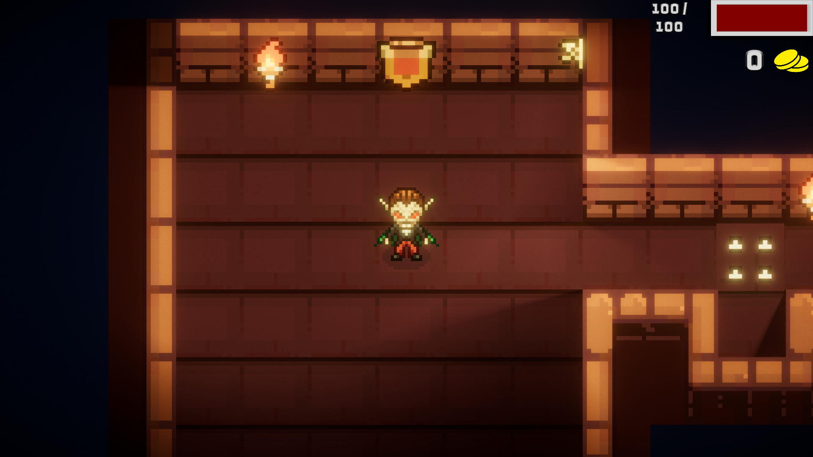

#  Sharkadula – 2D Top-Down RPG

A **2D Top-Down RPG** project developed in **Unity**, built upon principles of **modular architecture**, **clean code**, and **high reusability**. The game features **4-directional movement mechanics** set within a **dark, atmospheric Vampire/Dungeon world**.

[](https://www.youtube.com/watch?v=ROPM4pSV86M)
## 📐 Design Patterns Used

* **Singleton**
  Used for central systems such as `AudioManager` and `InputManager` to ensure **global access** while maintaining a **single source of truth**.

* **State Machine**
  Implemented to manage player and game states efficiently, eliminating complex and unmanageable `if-else` or `switch` chains.

## 🧩 Modular Player Controller

Instead of relying on a monolithic controller script, the player logic is divided into **small, focused components**:

* Movement
* Health
* Animation and Visual Part
* Inventory System


## ⚙️ Core Systems

### 🎮 Input & Audio Management

#### Input Manager

* Fully decoupled from Unity’s Input System
* Supports both **event-based** **centralized** handling

#### Audio Manager & Audio Mixer
* NO GC Performance friendly pooling system.
* Singleton-based global audio conrol
* Integrated with **Unity Audio Mixer**
* Supports grouped audio control (SFX, Music, Ambience)


---

### 🎞 Animation System

* Uses **Blend Trees** for smooth **4-directional movement**
* Simplifies animation transitions
* Highly scalable for future states such as combat, rolling, or casting

---

### 🗺 Environment & Lighting

* **Layered Tilemap Architecture**
  Make Sorting and collider easy  

* **2D Lighting System**
  Dynamic lighting and light casting are used to reinforce the dark Vampire/Dungeon atmosphere.

---

## 💻 Implementation Details

Below are selected examples demonstrating the project’s clean, data-driven, and decoupled architecture.

---

### 🔊 1. Data-Driven Audio System

Audio behavior is defined using **ScriptableObjects**, separating **data** from **logic**.

```csharp
public class Ambience : MonoBehaviour
{
    [SerializeField] AudioData ambienceData; // Holds random settings & clips Scriptable Object

    private void Start()
    {
        // Plays sound with centralized control via Singleton
        AudioManager.Instance.PlaySound(ambienceData);
    }
}
```

**Benefits:**

* No hardcoded audio values 
* Easy reuse across multiple scenes

---

###  2. Input System

Event based singelton centralized input system.

```csharp
InputManager.Instance.Subscribe(InputType.Interact, OnInteract);
```

#### Easy read input

```csharp
Vector2 moveDir = InputManager.Instance.ReadInput<Vector2>(InputType.Move);
```

---

### 🔁 3. State Machine Structure

Character behaviors are encapsulated in **distinct state classes** implementing a shared interface.

```csharp
public override void CheckTransitions() {
    base.CheckTransitions();
    if (_input != Vector2.zero) {
        var state = _machine.GetState<MoveState>();
        _machine.SetState(state);
    }
}
```


* No bunch of switch-case and if-else loops!

---

## 🛠 Libraries & Tools

The following tools were used to accelerate development and improve editor workflow:

### NaughtyAttributes

* Improves Inspector usability
* Reduces boilerplate editor code
* Used specifically for the **[Scene] attribute**, enabling safe scene assignment without string-based errors

### LeanTween

* UI animations
* Smooth movement interpolations
* Efficient **Delayed Call** functionality
* Avoids unnecessary `IEnumerator` / Coroutine usage

---

## 🎨 Used Assets

* **Free Vampire 4-Direction Pixel Character Sprite Pack**
* **Dungeon Asset Pack**

---

## Future Plans 
* Design levels.
* More complex Inventory System.
* NPC and battle System
